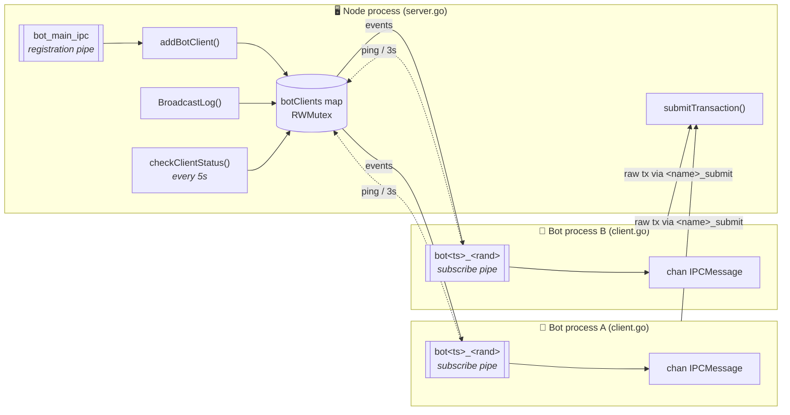
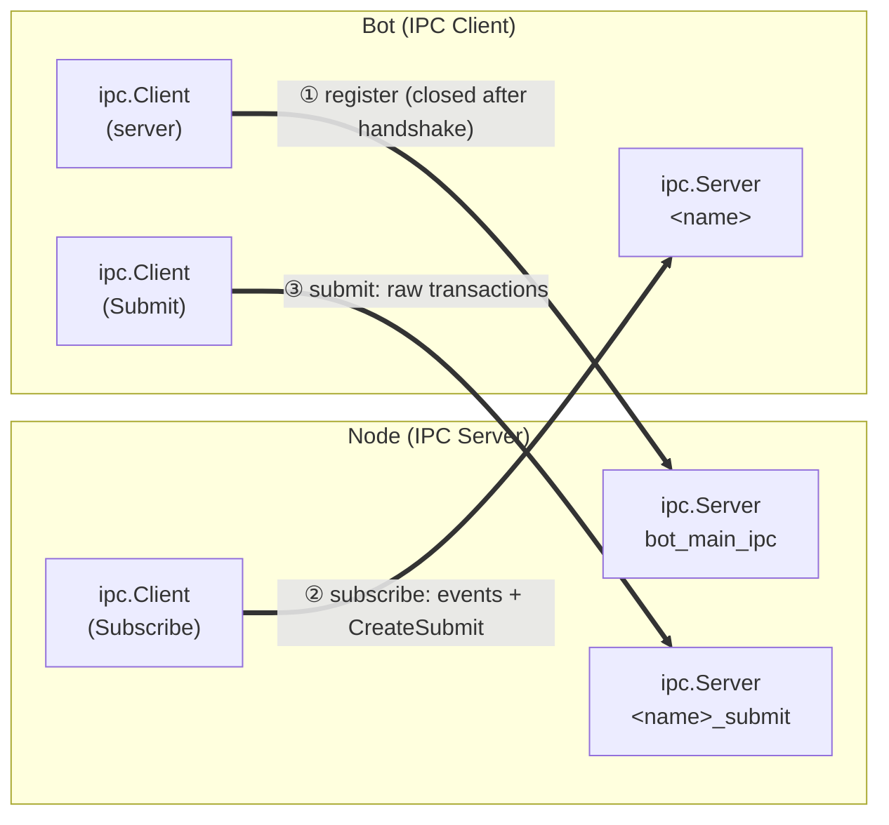
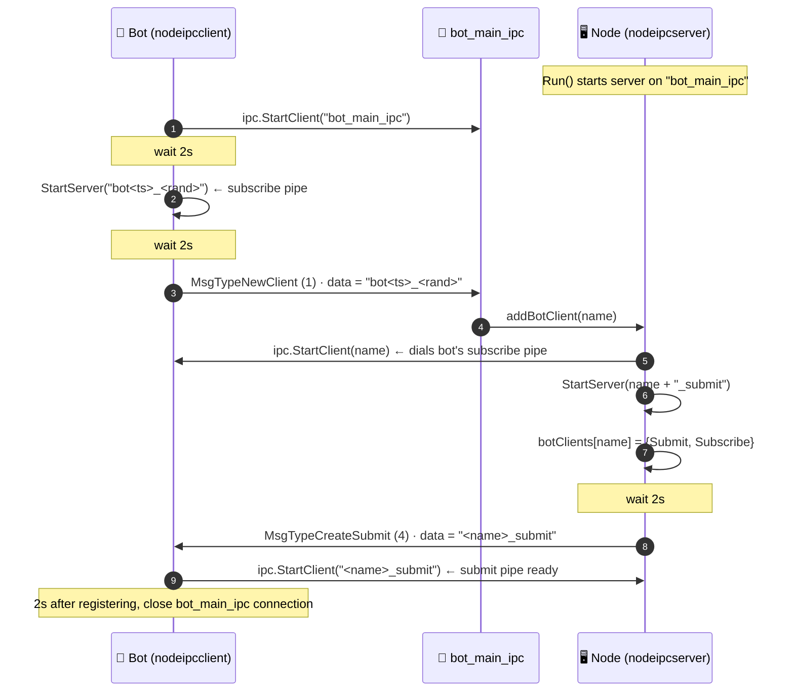
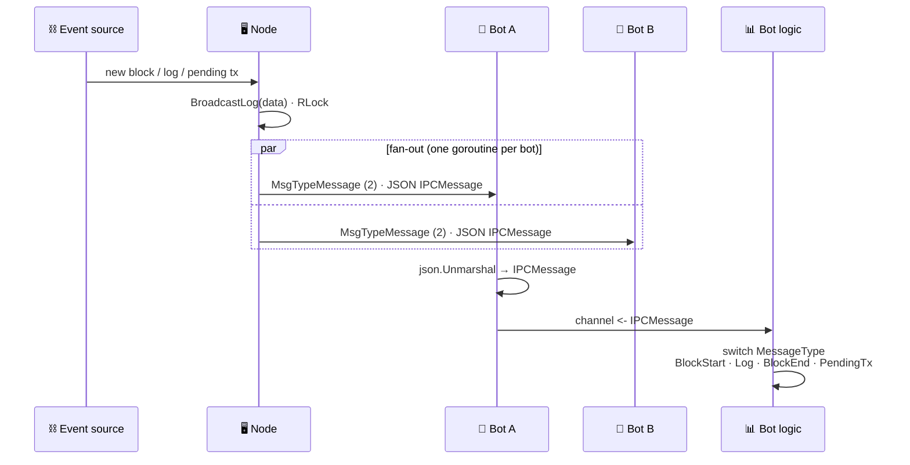
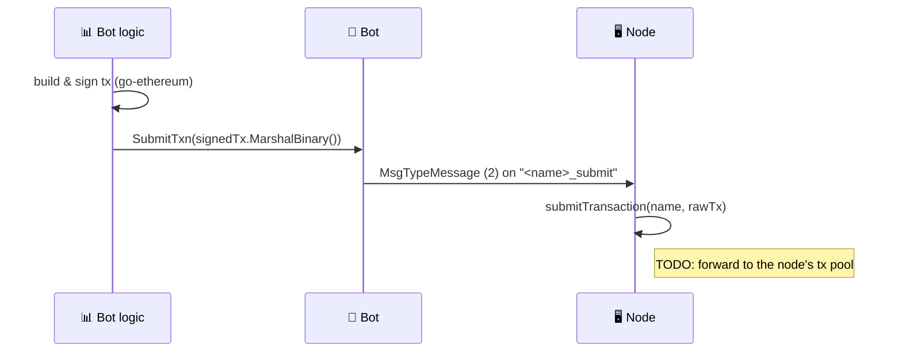
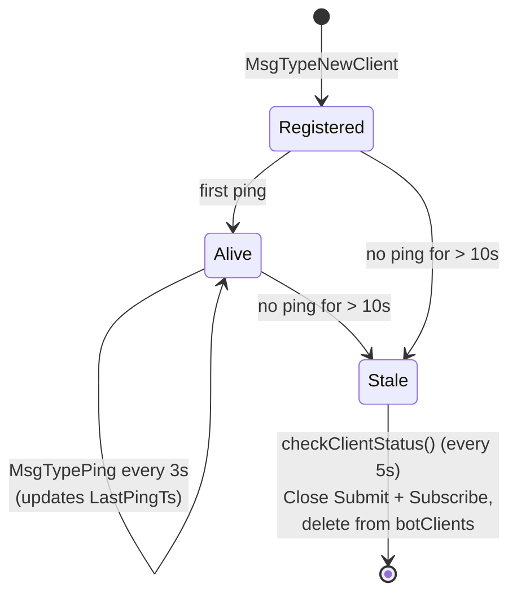
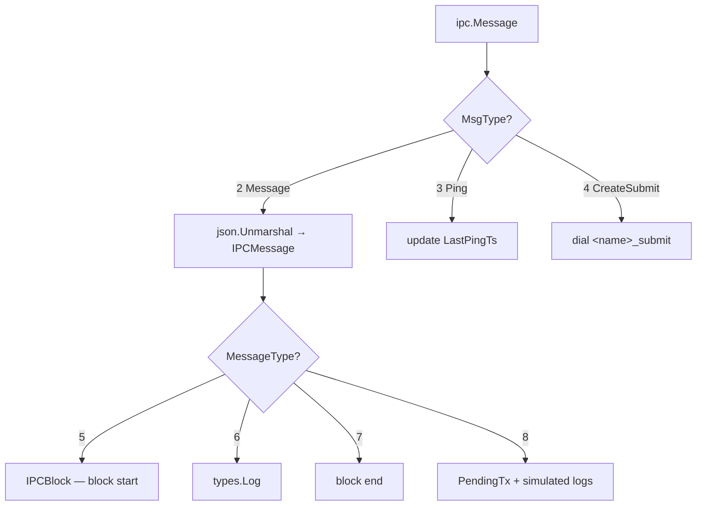

<div align="center">

# 🔌 go-ipc

**Bidirectional inter-process communication in Go, built for streaming blockchain events to trading bots.**


</div>

---

## 📖 Overview

`go-ipc` connects a single **node-side IPC server** to any number of **bot clients** running as separate processes on the same machine. Each bot gets two dedicated channels:

| Channel | Direction | Purpose |
|---|---|---|
| **Subscribe** | Server ➜ Bot | Broadcast blocks, logs and pending transactions |
| **Submit** | Bot ➜ Server | Send signed raw transactions back to the node |

All transport is handled by [`james-barrow/golang-ipc`](https://github.com/james-barrow/golang-ipc), which uses **named pipes on Windows** and **Unix domain sockets on Linux/macOS**, so there is no TCP/HTTP overhead between the node and its bots.

---

## 🏗️ Architecture



### Pipes per bot

Every connected bot results in **three** pipes over its lifetime:



> 💡 Notice the role reversal: for the **subscribe** pipe the *bot* hosts the server and the *node* dials in. This lets the node push to each bot over its own dedicated pipe.

---

## 🔄 Communication Workflow

### 1. Handshake & registration



### 2. Event streaming (Server ➜ Bot)



### 3. Transaction submission (Bot ➜ Server)



### 4. Heartbeat & eviction



---

## 📨 Message Protocol

Every frame on the wire is a `golang-ipc` message with an integer `MsgType` and a `[]byte` payload.

### Transport-level message types

| Value | Constant | Direction | Payload |
|:---:|---|---|---|
| `0` | `MsgTypeNone` | — | ignored |
| `1` | `MsgTypeNewClient` | Bot ➜ Node (main pipe) | bot's subscribe pipe name |
| `2` | `MsgTypeMessage` | both | JSON `IPCMessage` (subscribe) or raw tx bytes (submit) |
| `3` | `MsgTypePing` | Bot ➜ Node (subscribe pipe) | `[]byte{1}` |
| `4` | `MsgTypeCreateSubmit` | Node ➜ Bot (subscribe pipe) | submit pipe name |

### Application-level envelope

`MsgTypeMessage` frames on the subscribe pipe carry a JSON envelope whose inner `messageType` tells the bot how to decode `messageData`:

```go
type IPCMessage struct {
    MessageType MsgType `json:"messageType"`
    MessageData []byte  `json:"messageData"` // base64 in JSON
}
```

| Value | Constant | `messageData` decodes to |
|:---:|---|---|
| `5` | `MsgTypeBlockStart` | `IPCBlock{BlockNumber, BlockTimestamp}` |
| `6` | `MsgTypeLog` | go-ethereum `types.Log` |
| `7` | `MsgTypeBlockEnd` | — (marker) |
| `8` | `MsgTypePendingTx` | `PendingTx{TxHash, From, To, Nonce, Gas*, Data, Logs, …}` |



---

## 📁 Project Structure

```text
go-ipc/
├── server.go               # Demo node: runs IPC server, broadcasts every 5s
├── client.go               # Demo bot: subscribes and prints events, can submit txs
├── wsClient.go             # Standalone WebSocket client for comparison (no IPC)
├── nodeipcserver/          # Node-side library
│   ├── server.go           #   Shared(), Run(), BroadcastLog(), health checks
│   ├── constant/           #   BotMainIPC = "bot_main_ipc"
│   ├── message/            #   Client/Server wrappers + message types
│   └── utils/
└── nodeipcclient/          # Bot-side library
    ├── client.go           #   Shared(), Run(chan), SubmitTxn()
    ├── constant/
    ├── message/            #   Client/Server wrappers + IPCMessage, PendingTx
    └── utils/
```

---

## 🚀 Getting Started

### Prerequisites

- Go **1.19+**

```bash
go mod download
```

### Run the server (node side)

```bash
go run server.go
```

### Run one or more clients (bot side)

In separate terminals:

```bash
go run client.go
```

> ⚠️ `server.go`, `client.go` and `wsClient.go` each declare their own `main`, so run them **file by file** as shown above rather than `go run .` / `go build ./...`.

### Expected output

```text
# server
2026-10-06T10:00:00Z IpcServer Start
2026-10-06T10:00:04Z IpcServer received new bot client client bot1759744804000_42137
2026-10-06T10:00:06Z IpcServer sending create submit to client client bot1759744804000_42137 submit bot1759744804000_42137_submit
2026-10-06T10:00:10Z IpcServer BroadcastLog start clients 1 len 12

# client
Client starting
2026-10-06T10:00:04Z Client sending add new bot: bot1759744804000_42137
2026-10-06T10:00:04Z Client sent add new bot
```

> ℹ️ The demo server broadcasts the plain string `"Hello Client"`. Since the bot expects a JSON `IPCMessage`, it will log `JSON parse Error` for those frames. Real producers should send a JSON-encoded `IPCMessage` (see below).

---

## 🧩 Usage as a Library

### Node side — broadcast events

```go
import (
    "encoding/json"
    nodeipc "go-ipc/nodeipcserver"
    "go-ipc/nodeipcserver/message"
)

func main() {
    go nodeipc.Shared().Run()

    block, _ := json.Marshal(message.IPCBlock{BlockNumber: 123, BlockTimestamp: 1700000000})
    envelope, _ := json.Marshal(message.IPCMessage{
        MessageType: message.MsgTypeBlockStart,
        MessageData: block,
    })
    nodeipc.Shared().BroadcastLog(envelope)
}
```

### Bot side — consume events & submit transactions

```go
import (
    nodeipc "go-ipc/nodeipcclient"
    "go-ipc/nodeipcclient/message"
)

func main() {
    events := make(chan message.IPCMessage)
    if err := nodeipc.Shared().Run(events); err != nil {
        panic(err)
    }

    for ev := range events {
        switch ev.MessageType {
        case message.MsgTypeBlockStart: /* ... */
        case message.MsgTypeLog:        /* ... */
        case message.MsgTypePendingTx:  /* ... */
        }
    }

    // anywhere, once the submit pipe exists:
    // nodeipc.Shared().SubmitTxn(rawSignedTx)
}
```

---

## ⏱️ Timing Reference

| Constant | Value | Where |
|---|---|---|
| Handshake settle delays | 2s each | `nodeipcclient.Run`, `nodeipcserver.addBotClient` |
| Bot ping interval | 3s | `nodeipcclient.startClientSchedule` |
| Health-check interval | 5s | `nodeipcserver.startServerSchedule` |
| Eviction timeout | 10s without ping | `nodeipcserver.checkClientStatus` |
| Demo broadcast interval | 5s | `server.go` |

---

## 🙏 Acknowledgements

- [james-barrow/golang-ipc](https://github.com/james-barrow/golang-ipc) — cross-platform IPC transport
- [ethereum/go-ethereum](https://github.com/ethereum/go-ethereum) — transaction and log types
